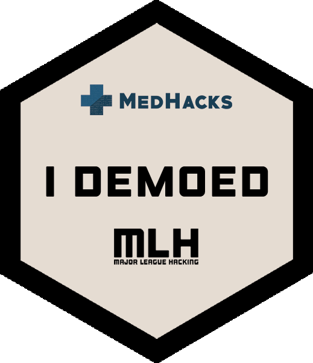

# Stickers

This is a repo trying to recreate stickers I had on my old laptop...

# What is this

I recenty upgraded laptops and wanted to move all of the stickers from my old laptop to the new one.  Unfortunately, a majority of the stickers are limited print hackathon stickers and trying to move them generally ruins the adheisive on the back.

This is my attempt to recreate these stickers in photoshop.

## Requirements

- [Vinyl Sticker Paper](https://www.amazon.com/gp/product/B07NX2VK6K)
- [Cricket/Sillhoute Cutting Machine](https://www.amazon.com/dp/B07VLB3627)
- [Clear Spray Paint/Waterproof Coating](https://www.amazon.com/Krylon-K01305-Coatings-11-Ounce-UV-Resistant/dp/B00397STRW/ref=sr_1_5?keywords=spray+coating&qid=1575599447&sr=8-5)
- Ink Jet Printer

## Med Hacks 2018 (Johns Hopkins University)

  

<h2 align="center"><a href="medHacks/medHacksFinal.psd">Photoshop Template</a></h1>

<h2 align="center"><a href="medHacks/medHacksFinal.png">PNG Image</a></h1>
