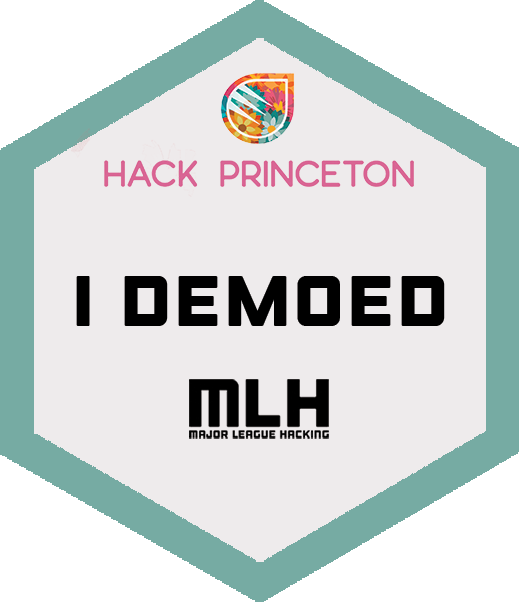
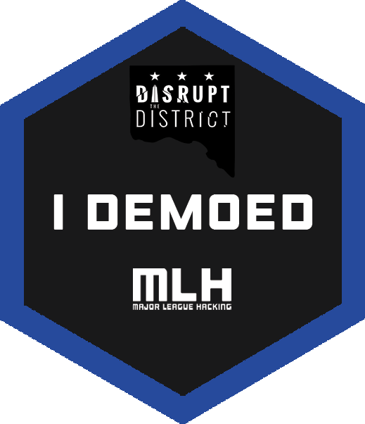

# Stickers

This is a repo trying to recreate stickers I had on my old laptop...

# What is this

I recenty upgraded laptops and wanted to move all of the stickers from my old laptop to the new one.  Unfortunately, a majority of the stickers are limited print hackathon stickers and trying to move them generally ruins the adheisive on the back.

This is my attempt to recreate these stickers in photoshop.

## Results

  

These are the printed stickers on my Macbook

## Requirements

- [Vinyl Sticker Paper](https://www.amazon.com/gp/product/B07NX2VK6K)
- [Cricket/Sillhoute Cutting Machine](https://www.amazon.com/dp/B07VLB3627)
- [Clear Spray Paint/Waterproof Coating](https://www.amazon.com/Krylon-K01305-Coatings-11-Ounce-UV-Resistant/dp/B00397STRW/ref=sr_1_5?keywords=spray+coating&qid=1575599447&sr=8-5)
- Ink Jet Printer

## Med Hacks 2018 (Johns Hopkins University)

  

<h2 align="center"><a href="medHacks/medHacksFinal.psd">Photoshop Template</a>  <a href="medHacks/medHacksFinal.png">PNG Image</a></h2>

## Hack Princeton 2018 (Princeton University)

  

<h2 align="center"><a href="hackPrinceton/hackPrincetonFinal.psd">Photoshop Template</a>  <a href="hackPrinceton/hackPrincetonFinal.png">PNG Image</a></h2>

## HackTech 2019 (Caltech)

  

<h2 align="center"><a href="hackTech/hackTechFinal.psd">Photoshop Template</a>  <a href="hackTech/hackTechFinal.png">PNG Image</a></h2>

## Auburn Hacks (Auburn University)

  

<h2 align="center"><a href="auburnHacks/auburnHacksFinal.psd">Photoshop Template</a>  <a href="auburnHacks/auburnHacksFinal.png">PNG Image</a></h2>

## Disrupt the District (Washington, DC)

  

<h2 align="center"><a href="disruptTheDistrict/disruptTheDistrictFinal.psd">Photoshop Template</a>  <a href="disruptTheDistrict/disruptTheDistrictFinal.png">PNG Image</a></h2>

## Hack GT 2017 (Georgia Tech)

  

<h2 align="center"><a href="hackGT/HackGTFinal.psd">Photoshop Template</a>  <a href="hackGT/HackGTFinal.png">PNG Image</a></h2>

## Hack GT 2018 (Georgia Tech)

  

<h2 align="center"><a href="hackGT/HackGTFinal2.psd">Photoshop Template</a>  <a href="hackGT/HackGTFinal2.png">PNG Image</a></h2>

## HackNC 2017 (UNC Chapel Hill)

  

<h2 align="center"><a href="hackNC/hackNCFinal.psd">Photoshop Template</a>  <a href="hackNC/hackNCFinal.png">PNG Image</a></h2>

## UGA Hacks (University of Georgia)

  

<h2 align="center"><a href="ugaHacks/ugaHacksFinal.psd">Photoshop Template</a>  <a href="ugaHacks/ugaHacksFinal.png">PNG Image</a></h2>

## HackGSU Fall 2018 (Georgia State University)

  

<h2 align="center"><a href="hackGSU/hackGSUFinal.psd">Photoshop Template</a>  <a href="hackGSU/hackGSUFinal.png">PNG Image</a></h2>

## HackGSU Spring 2019 (Georgia State University)

  

<h2 align="center"><a href="hackGSU/hackGSUFinal2.psd">Photoshop Template</a>  <a href="hackGSU/hackGSUFinal2.png">PNG Image</a></h2>

## VandyHacks (Vanderbilt University)

  

<h2 align="center"><a href="vandyHacks/vandyHacksFinal.psd">Photoshop Template</a>  <a href="vandyHacks/vandyHacksFinal.png">PNG Image</a></h2>

